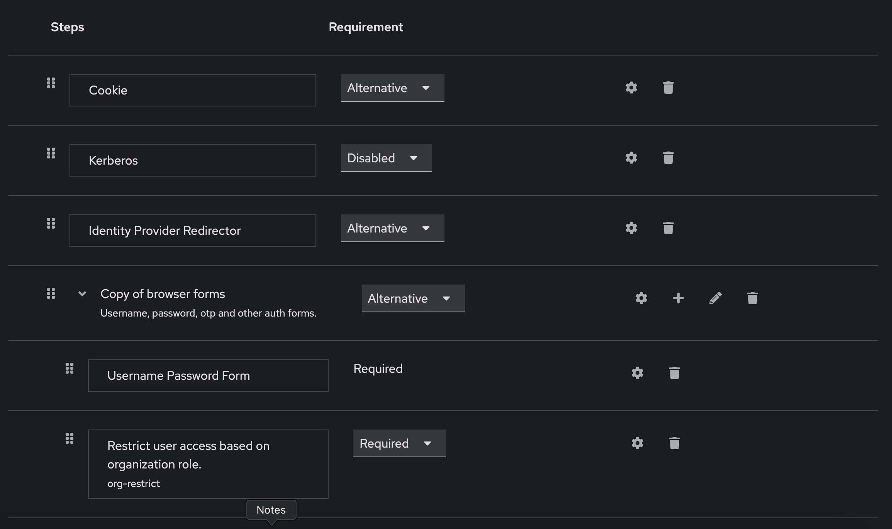
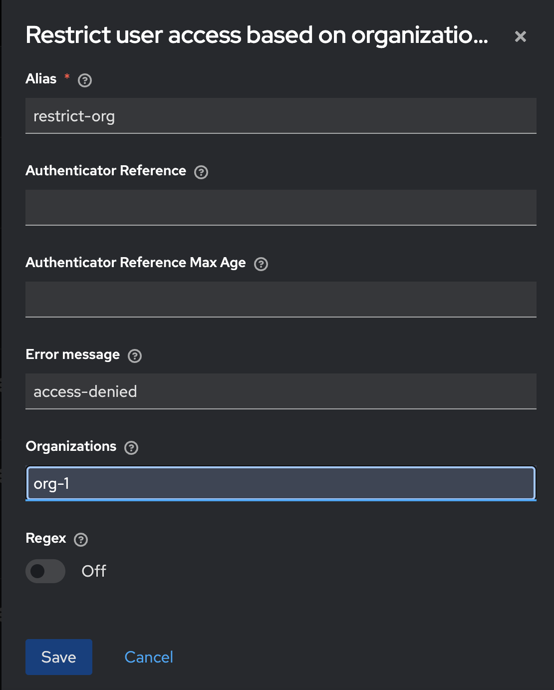
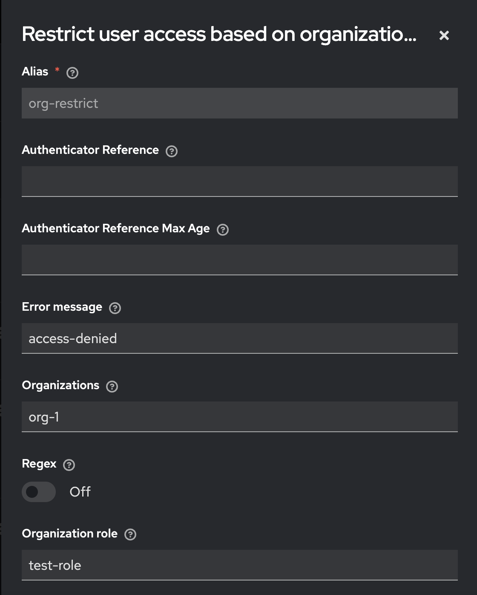

> :rocket: **Try it for free** in the new Phase
> Two [keycloak managed service](https://phasetwo.io/?utm_source=github&utm_medium=readme&utm_campaign=ext-keycloak-restrict-client-auth).

# ext-keycloak-restrict-client-auth

This Keycloak implementation offer a user the ability to restrict an authentication flow based on organization membership or organization role.

To achieve this two new authenticators where created:
1. Restrict user authentication on orgs
2. Restrict user authentication on org role

### Setup

In order to enable these authenticators add the following env variable `KC_RESTRICT_ORG_AUTHENTICATORS_ENABLED=true` or the system property `kc.community.restrict.org.authenticator.enabled=true`;

### Authentication flow example




### Installation

1. Build the jar:

```
mvn clean install
```
2. Copy the jar produced in `target/` to your `providers` directory (for Quarkus) or `standalone/deployments`
   directory (for legacy) and rebuild/restart keycloak.

### Releases

You can also download a release jar directly from [Maven Central](https://central.sonatype.com/artifact/io.phasetwo.keycloak/ext-keycloak-restrict-client-auth).

## Implementation Notes

The `RestrictOrgsAuthAuthenticator` is the template class which performs the logic for restricting. This logic is based on the `OrgsAccessProvider` interface
The `OrgsAccessProvider` interface contains two methods:
1. isRestricted - decides if the restriction applies to the user. If not the flow is marked as successful and will continue to the next step.
2. isPermitted - decides if the user verifies the authenticator conditions. If not the flow is stopped an the user gets a access denied message.


Both authenticators `Restrict user authentication on orgs` and `Restrict user access based on organization role` will implement the `OrgsAccessProvider` interface.

#### Restrict user authentication on orgs authenticator

The authenticator configuration contains two fields:

- Organizations - need to specify the name of the organization we configure (or regex).
- Regex - if the organization name configured in the configuration above should be evaluated as a regex,otherwise the evaluation of the name will be a exact string match.



The `OrgMembershipBasedAccessProvider` implements `OrgsAccessProvider` and performs the following logic:

1. isRestricted - evaluates to `true` if the user is part of an organization.
2. isPermitted - if the user is part of an organization which matches the name or regex.

#### Restrict user access based on organization role authenticator

The authenticator configuration contains the following fields:

- Organizations - need to specify the name of the organization we configure (or regex).
- Regex - if the organization name configured in the configuration above should be evaluated as a regex, otherwise the evaluation of the name will be a exact string match.
- Organization role - exact match of the organization role.



The `OrgRoleBasedAccessProvider` implements `OrgsAccessProvider` and performs the following logic:

1. isRestricted - evaluates to `true` if the user is part of an organization.
2. isPermitted - if the user is part of an organization which matches the name or regex AND has a role withing any of the matched organization.

## License

We’ve changed the license of our core extensions from the AGPL v3 to the [Elastic License v2](https://github.com/elastic/elasticsearch/blob/main/licenses/ELASTIC-LICENSE-2.0.txt).

Special thanks to Sven-Torben Janus for the [keycloak-restrict-client-auth](https://github.com/sventorben/keycloak-restrict-client-auth) project which we used as a base guideline for our implementation.

All documentation, source code and other files in this repository are Copyright 2024 Phase Two, Inc.

